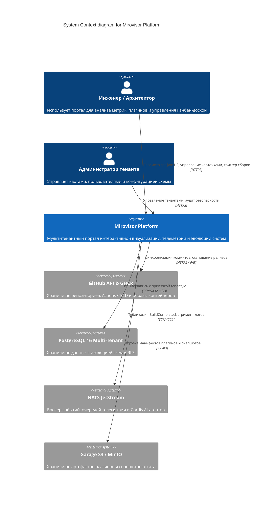
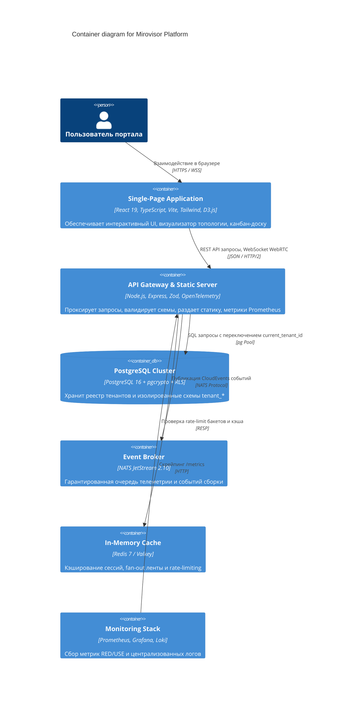

# Архитектурная модель C4 для платформы Mirovisor

## 1. Диаграмма системного контекста (System Context)

```mermaid
C4Context
    title System Context diagram for Mirovisor Platform

    Person(developer, "Инженер / Архитектор", "Использует портал для анализа метрик, плагинов и управления канбан-доской")
    Person(tenant_admin, "Администратор тенанта", "Управляет квотами, пользователями и конфигурацией схемы")

    System(mirovisor, "Mirovisor Platform", "Мультитенантный портал интерактивной визуализации, телеметрии и эволюции систем")

    System_Ext(github, "GitHub API & GHCR", "Хранилище репозиториев, Actions CI/CD и образы контейнеров")
    System_Ext(postgres, "PostgreSQL 16 Multi-Tenant", "Хранилище данных с изоляцией схем и RLS")
    System_Ext(nats, "NATS JetStream", "Брокер событий, очередей телеметрии и Cordis AI-агентов")
    System_Ext(garage_s3, "Garage S3 / MinIO", "Хранилище артефактов плагинов и снапшотов отката")

    Rel(developer, mirovisor, "Просмотр графов D3, управление карточками, триггер сборок", "HTTPS")
    Rel(tenant_admin, mirovisor, "Управление тенантами, аудит безопасности", "HTTPS")
    Rel(mirovisor, github, "Синхронизация коммитов, скачивание релизов", "HTTPS / PAT")
    Rel(mirovisor, postgres, "Чтение/запись с привязкой tenant_id", "TCP/5432 (SSL)")
    Rel(mirovisor, nats, "Публикация BuildCompleted, стриминг логов", "TCP/4222")
    Rel(mirovisor, garage_s3, "Загрузка манифестов плагинов и снапшотов", "S3 API")
```

## 2. Диаграмма контейнеров (Container Diagram)

```mermaid
C4Container
    title Container diagram for Mirovisor Platform

    Person(user, "Пользователь портала")

    Container(spa, "Single-Page Application", "React 19, TypeScript, Vite, Tailwind, D3.js", "Обеспечивает интерактивный UI, визуализатор топологии, канбан-доску")
    Container(gateway, "API Gateway & Static Server", "Node.js, Express, Zod, OpenTelemetry", "Проксирует запросы, валидирует схемы, раздает статику, метрики Prometheus")
    ContainerDb(db, "PostgreSQL Cluster", "PostgreSQL 16 + pgcrypto + RLS", "Хранит реестр тенантов и изолированные схемы tenant_*")
    Container(queue, "Event Broker", "NATS JetStream 2.10", "Гарантированная очередь телеметрии и событий сборки")
    Container(cache, "In-Memory Cache", "Redis 7 / Valkey", "Кэширование сессий, fan-out ленты и rate-limiting")
    Container(observability, "Monitoring Stack", "Prometheus, Grafana, Loki", "Сбор метрик RED/USE и централизованных логов")

    Rel(user, spa, "Взаимодействие в браузере", "HTTPS / WSS")
    Rel(spa, gateway, "REST API запросы, WebSocket WebRTC", "JSON / HTTP/2")
    Rel(gateway, db, "SQL запросы с переключением current_tenant_id", "pg Pool")
    Rel(gateway, queue, "Публикация CloudEvents событий", "NATS Protocol")
    Rel(gateway, cache, "Проверка rate-limit бакетов и кэша", "RESP")
    Rel(observability, gateway, "Скрейпинг /metrics", "HTTP")
```
